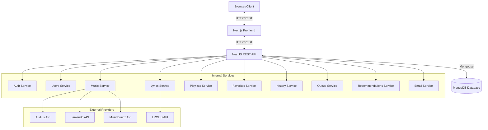

# Application Architecture

## Overview
The application is a full-stack music streaming platform built using a modern, scalable monorepo architecture. The primary objective is to separate concerns across the frontend, backend, and external providers while maintaining a robust and secure data flow.

## Technology Stack
- **Frontend**: Next.js (App Router), React, Tailwind CSS, TypeScript, TanStack Query, Zustand.
- **Backend**: NestJS, TypeScript, REST API, Mongoose.
- **Database**: MongoDB.
- **Authentication**: JWT/Session based with Email OTP (Nodemailer, Bcrypt/Argon2).
- **External Providers**: Audius, Jamendo, MusicBrainz, LRCLIB.

## System Architecture



## Security & Data Flow
1. **Frontend-Backend**: The frontend (Next.js) only communicates with the backend (NestJS) via secure REST API calls. 
2. **Backend-Database**: The frontend never has direct access to MongoDB. Only NestJS communicates with MongoDB using Mongoose.
3. **Provider Abstraction**: Provider secrets (like `AUDIUS_API_KEY` and `JAMENDO_CLIENT_ID`) are stored strictly on the backend. The frontend requests data generically, and the backend delegates to the correct provider and normalizes the response.
4. **Authentication Flow**: Entirely email/password based with OTP verification. No external OAuth providers. Plaintext OTPs and passwords are never stored in the database.

## Final Folder Structure
The project will be migrated from a standard Next.js root project into a monorepo structure.

```text
music-player/
├── apps/
│   ├── web/                     # Next.js Frontend App
│   │   ├── app/
│   │   ├── components/
│   │   ├── hooks/
│   │   ├── stores/              # Zustand stores
│   │   ├── lib/
│   │   └── types/
│   └── api/                     # NestJS Backend App
│       └── src/
│           ├── auth/
│           ├── users/
│           ├── music/
│           ├── providers/
│           │   ├── audius/
│           │   ├── jamendo/
│           │   ├── musicbrainz/
│           │   └── lrclib/
│           ├── lyrics/
│           ├── playlists/
│           ├── favorites/
│           ├── history/
│           ├── queue/
│           ├── recommendations/
│           ├── database/
│           └── common/
├── packages/
│   └── shared-types/            # Shared TypeScript interfaces
├── docs/                        # Project Documentation
│   ├── architecture.md
│   ├── api.md
│   ├── database.md
│   ├── providers.md
│   └── development-workflow.md
├── .env.example
├── README.md
└── package.json                 # Monorepo root configuration
```
