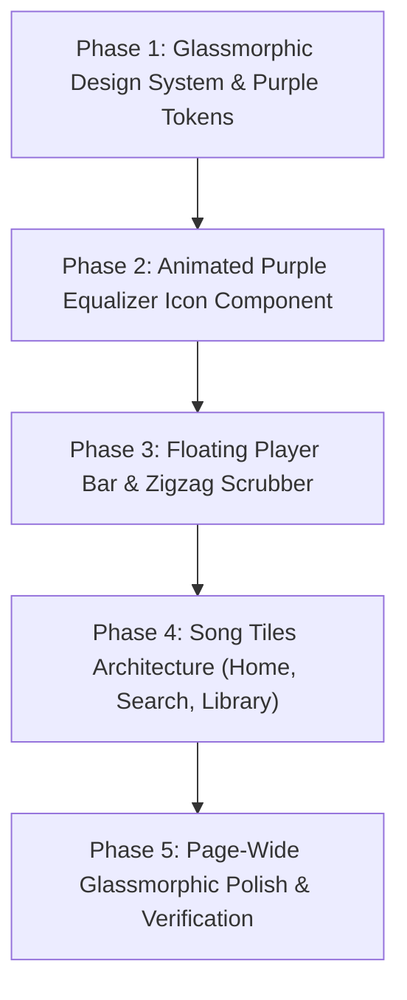

# Implementation Plan: Ultra-Premium Glassmorphic Redesign & Aesthetic Zigzag Progression Bar

Upgrade the entire website into an **ultra-premium, Apple/macOS-grade glassmorphic music streaming platform**, featuring:
1. **Signature Purple Color Harmony**: Strict adherence to the current shade of purple (`#8b5cf6`) across a curated scale of deep violet backdrops, luminous frosted glass panels, and glowing neon accents.
2. **Aesthetic Zigzag Song Progression Bar**: An interactive, dynamic SVG zigzag waveform scrubber in the Player Bar with glowing laser gradients and seek-drag responsiveness.
3. **Animated 3-Bar Equalizer Icon**: A custom animated soundwave equalizer indicator (3 vertical bars constantly animating up and down randomly in our purple shade) showing active playback across song tiles and lists.
4. **Song Tiles Grid Architecture**: Aesthetic frosted glass song tiles across Home shelves, Search, Artist top songs, and Library pages.

---

## User Review Required

> [!IMPORTANT]
> **Color Palette Rule**: As requested, we will use the **current shade of purple** (`#8b5cf6`) and strictly use different shades and tints of this exact purple (from deep obsidian violet `#07040d` up to luminous lavender glow `#c4b5fd`), with zero unrelated color contamination.

> [!TIP]
> **Aesthetic Zigzag Progress Bar Interaction**: The new progress bar will use an interactive SVG zigzag path with smooth hover-expansion, dynamic traveling glow while playing, and instant draggable scrubbing with timestamp tooltips.

---

## Phased Execution Roadmap

---

### Phase 1: Glassmorphism Design System & Purple Color Palette

#### [MODIFY] [globals.css](file:///c:/Users/VED/OneDrive/Desktop/music-player/apps/web/src/app/globals.css)
- **Establish Curated Purple Tokens**:
  - Deep background: `#07040d` (obsidian violet)
  - Card glass base: `rgba(139, 92, 246, 0.05)`
  - Elevated glass base: `rgba(139, 92, 246, 0.10)`
  - Specular top rim highlight: `inset 0 1px 1px 0 rgba(255, 255, 255, 0.18)`
  - Border tint: `rgba(139, 92, 246, 0.22)`
  - Border hover tint: `rgba(139, 92, 246, 0.55)`
  - Primary purple: `#8b5cf6` (core brand)
  - Deep purple: `#6d28d9` / `#4c1d95`
  - Neon glow purple: `#a78bfa` / `#c4b5fd`
  - Ambient drop shadow: `0 8px 32px 0 rgba(139, 92, 246, 0.25)`
- **Glass Utility Classes**:
  - `.glass-dock`: Floating frosted glass container with `backdrop-filter: blur(28px) saturate(190%)` and inner specular highlight.
  - `.glass-card`: Interactive frosted glass surface with 3D hover lift and subtle purple glow reflection.
  - `.glass-tile`: Translucent tile with smooth borders for song cards.
  - `.glass-pill`: Luminous pill for search chips, badges, and controls.

---

### Phase 2: Animated 3-Bar Equalizer Component (`EqualizerBars.tsx`)

#### [NEW] [EqualizerBars.tsx](file:///c:/Users/VED/OneDrive/Desktop/music-player/apps/web/src/components/ui/EqualizerBars.tsx)
- Reusable component inspired by the user's reference image:
  - 3 (or 4) vertical rounded bars.
  - Rendered in our signature purple `#8b5cf6` with a soft ambient neon glow.
  - Independent, asynchronous CSS keyframe animations simulating real music audio activity:
    - Bar 1: `anim-eq-1` (0.8s alternate ease-in-out)
    - Bar 2: `anim-eq-2` (0.5s alternate ease-in-out)
    - Bar 3: `anim-eq-3` (0.95s alternate ease-in-out)
    - Bar 4: `anim-eq-4` (0.65s alternate ease-in-out)
  - When `isPlaying === true`: Bars continuously animate up and down randomly.
  - When paused: Bars settle smoothly to a gentle static baseline height.
  - Supports size variants: `sm` (16px, for list rows and track cards), `md` (20px, for player bar and headers), and `lg` (28px).

---

### Phase 3: Floating Player Bar & Aesthetic Zigzag Progression Bar

#### [NEW] [ZigzagProgressBar.tsx](file:///c:/Users/VED/OneDrive/Desktop/music-player/apps/web/src/components/ui/ZigzagProgressBar.tsx)
- Custom interactive SVG zigzag audio scrubber:
  - Responsive geometric peaks and valleys (`/\/\/\/\/\`) calculated dynamically to fit available width.
  - **Unplayed Track**: Translucent muted purple glass path (`rgba(139, 92, 246, 0.25)`).
  - **Played Track**: Luminous gradient stroke (`#7c3aed` $\rightarrow$ `#8b5cf6` $\rightarrow$ `#c4b5fd`) with SVG filter neon glow (`drop-shadow(0 0 6px rgba(139, 92, 246, 0.8))`).
  - **Pulsing Playhead Bead**: Glowing diamond or circular bead at the current playback position.
  - **Active Play Pulse**: When music is playing, a subtle traveling energy wave shimmers along the zigzag peaks.
  - **Full Drag & Scrub Support**: Pointer events calculate seek percentage with instant response and time tooltip on hover.

#### [MODIFY] [PlayerBar.tsx](file:///c:/Users/VED/OneDrive/Desktop/music-player/apps/web/src/components/layout/PlayerBar.tsx)
- Transform Player Bar into a **Floating Frosted Glass Dock**:
  - Elevated slightly above the bottom with rounded corners, specular highlight, and purple backdrop shadow.
  - Embed `<EqualizerBars />` next to the track title and album art.
  - Integrate `<ZigzagProgressBar />` in place of the flat linear bar.
  - Frosted glass volume scrubber with purple fill.
  - Glass control buttons with purple hover glow.

---

### Phase 4: Song Tiles Architecture (Deciding Tile Placement)

#### Where Songs are Displayed in Tiles:
1. **Home Discovery Shelves (`/`)**:
   - Daily Mix, Trending, and Recommended songs displayed as **Rich Frosted Glass Song Tiles** with square artwork, animated equalizer overlay on active play, title, artist, and hover play button.
2. **Search Page (`/search`)**:
   - In `All` view and `Songs` view: songs displayed in clean glass tiles with purple accent borders and active playing states.
3. **Artist Page (`/artist/[id]`)**:
   - Top songs 3-row horizontal columns enhanced into frosted glass tiles with specular highlights and `<EqualizerBars />` replacing rank numbers during playback.
4. **Favorites & Playlists (`/favorites`, `/playlists/[id]`)**:
   - Provide clean view toggle (Tiles Grid vs Table List) so songs can be browsed in aesthetic glass tiles.

#### [MODIFY] [TrackCard.tsx](file:///c:/Users/VED/OneDrive/Desktop/music-player/apps/web/src/components/ui/TrackCard.tsx)
- Upgrade `TrackCard` into a glassmorphic song tile:
  - Frosted glass background (`.glass-card`), subtle purple border reflection.
  - Embed `<EqualizerBars />` on the card when this track is playing.
  - Floating play/pause button with purple glow.
  - Clickable artist name and 3-dots `TrackMenu`.

---

### Phase 5: Page-Wide Glassmorphic Polish & Verification

#### [MODIFY] [MainLayout.tsx](file:///c:/Users/VED/OneDrive/Desktop/music-player/apps/web/src/components/layout/MainLayout.tsx)
- Add ambient diffuse purple radial backlights that softly glow in the background.
- Ensure sidebar and header blend seamlessly into the frosted glass ecosystem.

---

## Verification Plan

### Visual & Interactive Verification
1. **Glassmorphism Depth**:
   - Verify specular top rim highlights and translucent frosted backgrounds in dark mode.
2. **Aesthetic Zigzag Progress Bar**:
   - Verify continuous zigzag waveform render.
   - Verify accurate time progress fill in purple gradient.
   - Test click-to-seek and drag-to-seek across the zigzag.
   - Verify traveling neon pulse while audio is playing.
3. **Equalizer Bars Icon**:
   - Confirm 3-4 vertical bars animate up and down randomly in purple when music is playing.
   - Confirm bars freeze/settle into baseline when paused.
   - Verify presence in PlayerBar and active song tiles.
4. **Song Tiles Grid**:
   - Inspect song tiles on Home, Search, and Artist pages.
   - Confirm hover lift, glass borders, and play trigger.
5. **Chat Backup**:
   - Run `python export_chat_to_word.py` to keep `Chat_History.docx` synchronized.
